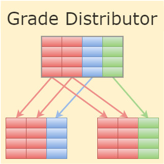

# Grade Distributor for Shared Drives

Grade Distributor is a Google Sheets add-on for distributing grades from a single spreadsheet to individual spreadsheets for each student. This fork adds some small changes (mostly function rewrites and adding extra arguments to function calls where appropriate) to get around the extra permissions associated with Shared Drives on Google Drive. 

## Additional Desired Features

For now this is out of scope, but some quality-of-life features include:
- Being able to key on other things besides name for making folders (i.e., email)
- Maintaining formatting when creating new copies of spreadsheets
